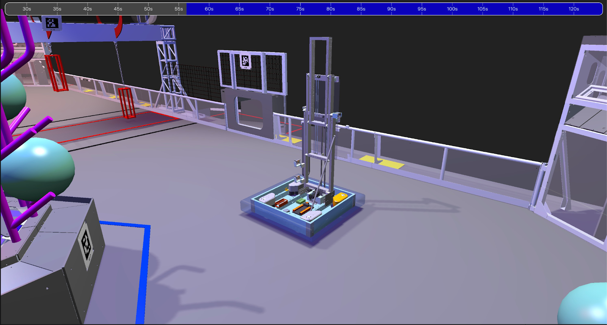

# 2473 GoldStrikers Simulation Models

## What is this?
This repo contains all of the models for robots that are used by 2473 GoldStrikers FRC team. They can be used in AdvantageScope and come configured. Each folder will contain a `README.md` file that explains what each model does. 

## Usage
Simply clone the repo and set your custom user assets folder to `FRC-2473-Sim-Models/ascopeAssets`.

To do this you can navigate to `Help > Use Custom Assets Folder`. 

Then navigate to `FRC-2473-Sim-Models` and select `ascopeAssets`.

## Issues
If you notice any issues with the models, create a github issue and make sure to add a picture of the bug.

